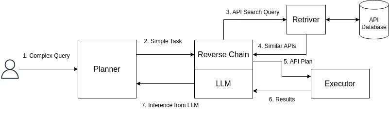

# Synergizing Language Models and APIs - Team_52
This implementation represents the solution proposed by Team_52. It employs a fusion of Reverse Chain layered upon RestGPT. RestGPT systematically breaks down complex user tasks into smaller, step-by-step components. Concurrently, Reverse Chain endeavors to fulfill these smaller tasks by utilizing the provided query and extracting relevant knowledge from the documentation. The detailed architecture for this solution is outlined below.



## Dependencies
- **Python3**: Ensure that you have Python 3 installed on your system. You can download and install Python 3 from the official Python website: https://www.python.org.
- **pip**: pip is the package installer for Python. It is usually installed by default when you install Python. However, make sure you have pip installed and it is up to date. You can check the version of pip by running the following command:
  ```
  pip --version
  ```
## Installation

To use our model, follow the steps given below:
- Navigate to the project directory: 
- Install the necessary Python packages by running the following command:
  ```
  pip install -r requirements.txt
  ```
(NOTE: It is recommended to install these requirements in a new python environment)

## How to use?

Follow the steps given below:

- Add the documentation of the APIs in the `data/api_documentation` folder in `.txt` format. The format in which the documentation is required is given in the folder.
- Make changes in the `example.config.ini` file
    - Add your OpenAI Secret Key in the `secret_key` variable in the `openai` section.
    - Add your query in the `query` variable in the `query` section.
    - Other parameters can also be changed in the config file like, model, temperature, huggingface embedding model that FAISS database will use 
- Initialize the FAISS database by executing the command below:
  ```
  python3 create_vector_db.py
  ```
  This will create the FAISS database using the documentation added in the `data/api_documentation`
- Now, the setup is complete :)
- Run the model by executing the command below:
  ```
  python3 main.py
  ```

## Output
The output of the run is saved in output.txt file and the logs are saved in run.log file.
